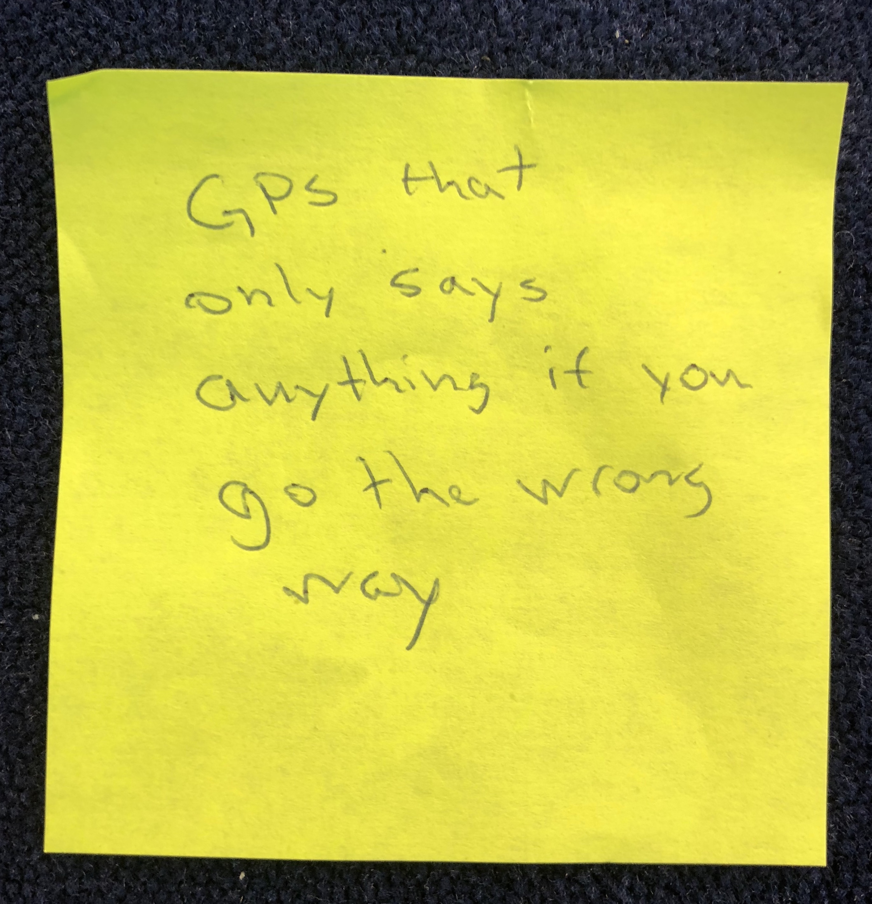

# WrongWay
A project for https://stupidhackath.no/

This project started here: 



And ended here (heads up: NSFW language, you might want put your headphones on): 

<div>
    <iframe width="560" height="315" src="https://www.youtube.com/embed/VR4cF1ixGMo" frameborder="0" allow="autoplay; encrypted-media" allowfullscreen></iframe>
</div>

## If you actually want to run this

You'll notice that the `APIKeys.swift` file is missing, because apparently now Google is going to start billing people for maps and places API use. 

To fix this, make your own `APIKeys.swift` and replace the contents with: 

```swift
import Foundation

enum APIKey: String {
  case GoogleMaps = "YOUR_GOOGLE_MAPS_API_KEY"
}
```

replacing `YOUR_GOOGLE_MAPS_API_KEY` with...your Google Maps API key. 
